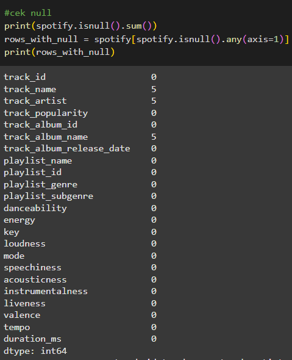
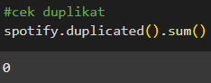
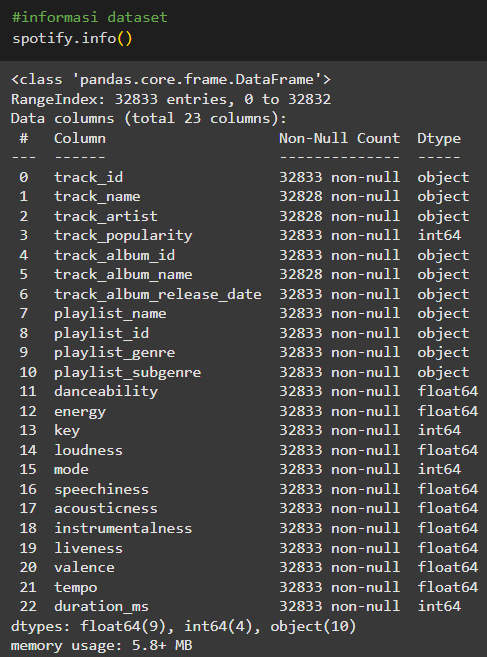
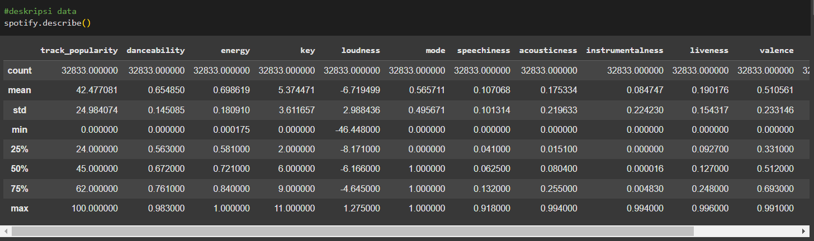
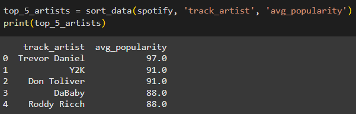

# 🎶 **Analisis Popularitas Musik Spotify** 🎶
## 💻 **Project Overview** 💻

Tersebarnya COVID-19 ke seluruh dunia pada awal 2020 mengakibatkan banyak aktivitas masyarakat yang terhambat demi mengurangi penyebaran virus tersebut. Mulai dari anak-anak yang bersekolah hingga orang dewasa yang bekerja terpaksa harus dilaksanakan di rumah. Hal ini menyebabkan banyak masyarakat yang merasa jenuh karena tidak dapat beraktivitas di luar rumah. Oleh karena itu, banyak warga yang mencari hiburan tanpa perlu keluar rumah salah satunya seperti mendengarkan lagu/musik. Musik adalah bagian integral dari kehidupan manusia. Dengan hadirnya platform streaming seperti Spotify, perilaku konsumsi musik telah berubah secara signifikan. Namun, pemahaman yang mendalam tentang bagaimana elemen-elemen musik tertentu, seperti popularitas, genre, atau karakteristik audio, mempengaruhi preferensi pengguna seringkali kurang dimanfaatkan. Sehingga, kami akan melakukan analisa mengenai selera musik masyarakat pada awal pandemi COVID-19.
Pendekatan yang kami usulkan untuk mengatasi masalah ini yaitu lakukan data cleaning terlebih dahulu, melihat statistik data, bisa dilanjutkan dengan melihat distribusi fitur, dan korelasi antar fitur.

Analisis ini diharapkan dapat membantu konsumen seperti kreator playlist agar dapat memahami tren musik yang populer sehingga playlist yang dibuat dapat membantu banyak pengguna Spotify mengatasi kejenuhan bukan hanya saat pandemi tetapi pada setiap saat. Selain itu, hasil ini juga relevan bagi musisi yang ingin membuat lagu agar sesuai dengan preferensi dan permintaan dari para penikmat lagu.
Dataset yang digunakan bersumber dari Spotify yang didapatkan dengan package spotifyr oleh Kaylin Pavlik dari 6 kategori/genre lagu yaitu EDM, Latin, Pop, R&B, Rap, & Rock. Dataset tersebut berisi 23 fitur dan 5000 lagu.


### Analisis Big Data A 🤼
* Ardhika Yoga Pratama (202110370311458)
* Romadhon Wiratama (202110370311471)

## Table of Contents 📖
* [Pendahuluan](#pendahuluan)
* [Package](#package)
* [Data Preparation](#data-preparation)
* [Rangkuman Analisis](#rangkuman-analisis)
* [Project Preparation](#project-preparation)


## Pendahuluan 🦖
Tersebarnya COVID-19 ke seluruh dunia pada awal 2020 mengakibatkan banyak aktivitas masyarakat yang terhambat demi mengurangi penyebaran virus tersebut. Mulai dari anak-anak yang bersekolah hingga orang dewasa yang bekerja terpaksa harus dilaksanakan di rumah. Hal ini menyebabkan banyak masyarakat yang merasa jenuh karena tidak dapat beraktivitas di luar rumah. Oleh karena itu, banyak warga yang mencari hiburan tanpa perlu keluar rumah salah satunya seperti mendengarkan lagu/musik. Musik adalah bagian integral dari kehidupan manusia. Dengan hadirnya platform streaming seperti Spotify, perilaku konsumsi musik telah berubah secara signifikan. Namun, pemahaman yang mendalam tentang bagaimana elemen-elemen musik tertentu, seperti popularitas, genre, atau karakteristik audio, mempengaruhi preferensi pengguna seringkali kurang dimanfaatkan. Sehingga, kami akan melakukan analisa mengenai selera musik masyarakat pada awal pandemi COVID-19.

Untuk menangani masalah di atas, kami akan menggunakan dataset Spotify yang didapatkan dari https://github.com/rfordatascience/tidytuesday/blob/main/data/2020/2020-01-21/ yang berisi 'track_id', 'track_name', 'track_artist', 'track_popularity', 'track_album_id', 'track_album_name', 'track_album_release_date',  'playlist_name', 'playlist_id', 'playlist_genre', 'playlist_subgenre', 'danceability', 'energy', 'key', 'loudness', 'mode', 'speechiness', 'acousticness', 'instrumentalness', 'liveness', 'valence', 'tempo', 'duration_ms'.

---

### Metodologi 🔬
Metodologi yang digunakan mencakup pembersihan data, EDA (Exploratory Data Analysis), analisis eksploratif dari berbagai fitur, serta visualisasi data.

---

### Pendekatan 🤝
Pendekatan yang kami usulkan untuk mengatasi masalah ini yaitu lakukan data cleaning terlebih dahulu, melihat statistik data, bisa dilanjutkan dengan melihat distribusi fitur, dan korelasi antar fitur.

---

### Tujuan Analisis 🎯
Analisis ini diharapkan dapat membantu konsumen seperti kreator playlist agar dapat memahami tren musik yang populer sehingga playlist yang dibuat dapat membantu banyak pengguna Spotify mengatasi kejenuhan bukan hanya saat pandemi tetapi pada setiap saat. Selain itu, hasil ini juga relevan bagi musisi yang ingin membuat lagu agar sesuai dengan preferensi dan permintaan dari para penikmat lagu.

## 📦 **Package** 📦
```bash
import pandas as pd
import matplotlib.pyplot as plt
import seaborn as sns
import numpy as np
import plotly.graph_objects as go
import plotly.express as px

from sklearn.preprocessing import MinMaxScaler
from sklearn.decomposition import PCA
from sklearn.linear_model import LinearRegression
```

## Data Preparation ⚔️
### Sumber Dataset 🫙
Dataset tersebut berisi 23 fitur dan 5000 lagu: 
[Dataset Spotify](https://github.com/rfordatascience/tidytuesday/blob/main/data/2020/2020-01-21/)

### Keterangan Dataset 🌞
Dataset bersumber dari Spotify yang didapatkan dengan package spotifyr oleh Kaylin Pavlik dari 6 kategori/genre lagu yaitu 
- EDM
- Latin 
- Pop
- R&B 
- Rap 
- Rock

### Pemrosesan Data ⚙️
1. Import Dataset dari Github
    ```bash
    !git clone https://github.com/Nvaraotr/ABD_project.git
    ```
2. Pembersihan Data
   - Memeriksa dan mengatasi missing value
     
   
   
   ```bash
    rata_rating = spotify.groupby('track_artist')['track_popularity'].mean()
    spotify['avg_popularity'] = spotify['track_artist'].map(round(rata_rating))

    ceknull = 0
    for i in spotify['avg_popularity']:
      if np.isnan(i):
        spotify['avg_popularity'] = spotify['avg_popularity'].fillna(spotify['avg_popularity'].mean())
    ```
   
   - Memeriksa dan duplicate value
     
   

4. Cetak Informasi dan Deskripsi Data
   
   
   
   
   
5. Pencarian Data Baru yang Dapat di Analisiskan
   ```bash
    rata_rating = spotify.groupby('track_artist')['track_popularity'].mean()
    spotify['avg_popularity'] = spotify['track_artist'].map(round(rata_rating))
    ```
   

   Dengan ditambahkannya variabel/fitur baru yaitu "avg_popularity" kita dapat melihat artis yang memiliki popularitas dari tertinggi sampai terendah berdasarkan lagu yang mereka buat

6. Kesimpulan Data
   Fitur "avg_popularity" dirancang untuk menghitung rata-rata popularitas lagu yang dihasilkan oleh seorang artis, berdasarkan gabungan kolom track_artist dan track_popularity. Fungsi utama fitur ini adalah untuk menilai konsistensi dan tingkat keberhasilan artis dalam menciptakan lagu-lagu populer.

## Rangkuman Analisis 📑
Berdasarkan analisis kami musik yang memiliki popularitas tinggi cenderung dapat digunakan untuk berdansa sehingga lagu-lagu ini dapat mengisi kejenuhan di saat pandemi ataupun saat ingin mendapatkan hiburan tetapi terbatasi situasi dan kondisi.

## 🦕 **Project Preparation** 🦖

- Dataset yang digunakan: [Spotify](https://github.com/rfordatascience/tidytuesday/tree/main/data/2020/2020-01-21)
- Project repository: [Repo_ABD](https://github.com/Nvaraotr/ABD_project)
- Running the project:
```bash
# Sebelum menjalankan source code, harap cloning atau download datasetnya terlebih dahulu
!git clone https://github.com/Nvaraotr/ABD_project.git
```
